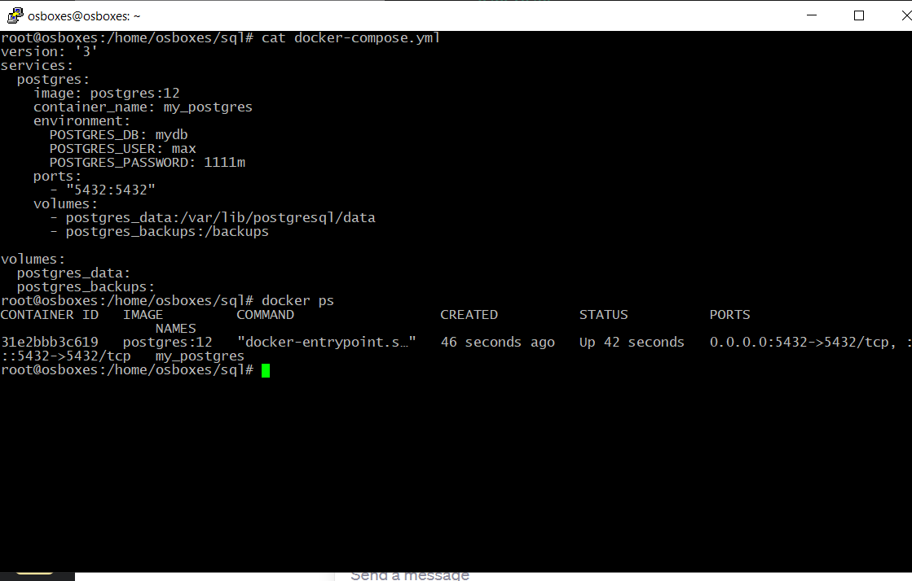
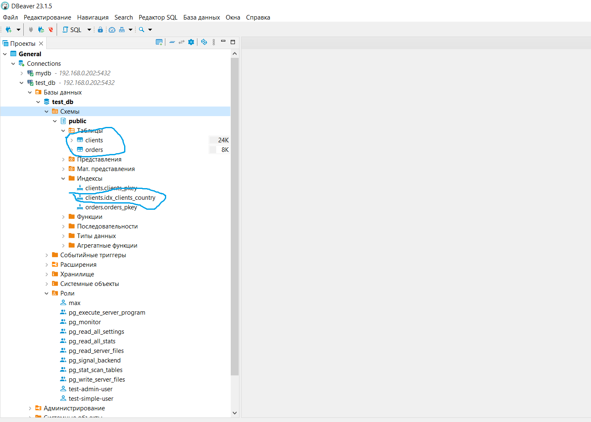
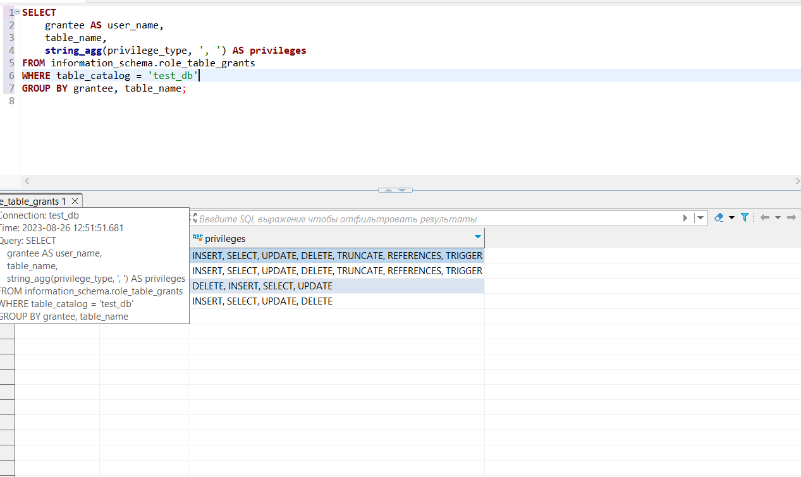
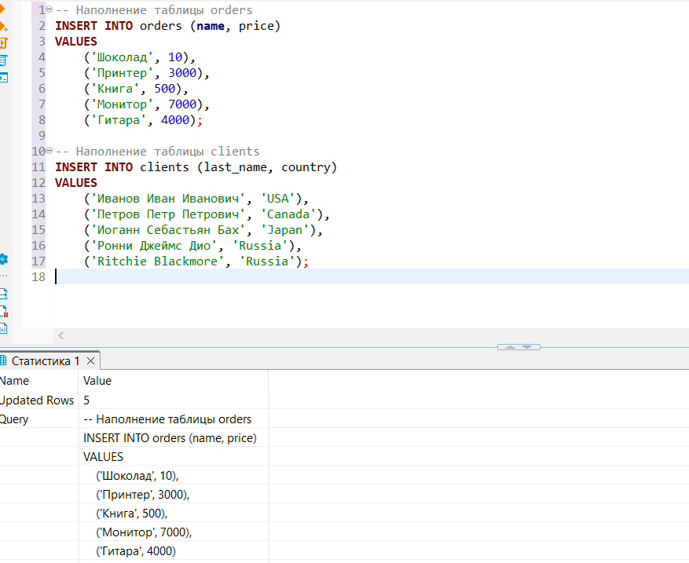
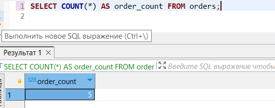
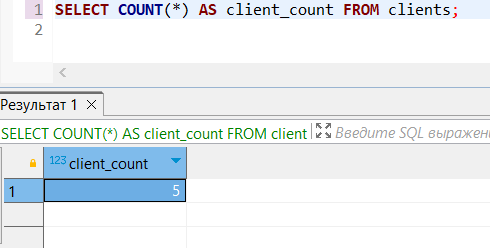
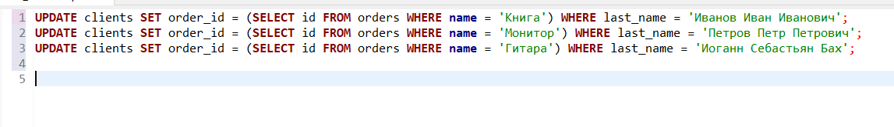
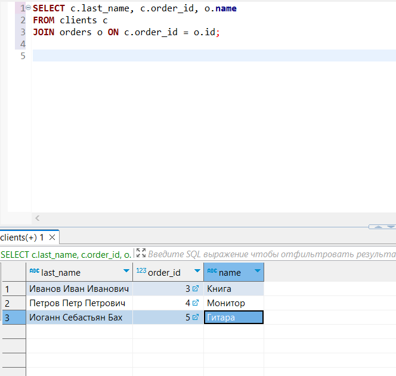

# `Домашнее задание к занятию 2. «SQL» - Зозуля Максим`


## Задача 1

Используя Docker, поднимите инстанс PostgreSQL (версию 12) c 2 volume, 
в который будут складываться данные БД и бэкапы.

Приведите получившуюся команду или docker-compose-манифест.



## Задача 2

В БД из задачи 1: 

- создайте пользователя test-admin-user и БД test_db;
- в БД test_db создайте таблицу orders и clients (спeцификация таблиц ниже);
- предоставьте привилегии на все операции пользователю test-admin-user на таблицы БД test_db;
- создайте пользователя test-simple-user;
- предоставьте пользователю test-simple-user права на SELECT/INSERT/UPDATE/DELETE этих таблиц БД test_db.

Таблица orders:

- id (serial primary key);
- наименование (string);
- цена (integer).

Таблица clients:

- id (serial primary key);
- фамилия (string);
- страна проживания (string, index);
- заказ (foreign key orders).

Приведите:

- итоговый список БД после выполнения пунктов выше;
- описание таблиц (describe);
- SQL-запрос для выдачи списка пользователей с правами над таблицами test_db;
- список пользователей с правами над таблицами test_db.




## Задача 3

Используя SQL-синтаксис, наполните таблицы следующими тестовыми данными:

Таблица orders

|Наименование|цена|
|------------|----|
|Шоколад| 10 |
|Принтер| 3000 |
|Книга| 500 |
|Монитор| 7000|
|Гитара| 4000|

Таблица clients

|ФИО|Страна проживания|
|------------|----|
|Иванов Иван Иванович| USA |
|Петров Петр Петрович| Canada |
|Иоганн Себастьян Бах| Japan |
|Ронни Джеймс Дио| Russia|
|Ritchie Blackmore| Russia|

Используя SQL-синтаксис:
- вычислите количество записей для каждой таблицы.

Приведите в ответе:

    - запросы,
    - результаты их выполнения.


)

## Задача 4

Часть пользователей из таблицы clients решили оформить заказы из таблицы orders.

Используя foreign keys, свяжите записи из таблиц, согласно таблице:

|ФИО|Заказ|
|------------|----|
|Иванов Иван Иванович| Книга |
|Петров Петр Петрович| Монитор |
|Иоганн Себастьян Бах| Гитара |

Приведите SQL-запросы для выполнения этих операций.

Приведите SQL-запрос для выдачи всех пользователей, которые совершили заказ, а также вывод этого запроса.
 
Подсказка: используйте директиву `UPDATE`.



## Задача 5

Получите полную информацию по выполнению запроса выдачи всех пользователей из задачи 4 
(используя директиву EXPLAIN).

Приведите получившийся результат и объясните, что значат полученные значения.

```
Hash Join  (cost=37.00..57.24 rows=810 width=68) (actual time=0.023..0.026 rows=6 loops=1) 
  Hash Cond: (c.id_order = o.id_order) # Связь между столбцами id_order в таблицах clients orders
  ->  Seq Scan on clients c  (cost=0.00..18.10 rows=810 width=36) (actual time=0.008..0.009 rows=10 loops=1)
# Операция последовательного сканирования
  ->  Hash  (cost=22.00..22.00 rows=1200 width=36) (actual time=0.008..0.009 rows=5 loops=1) # Операция построения хеш-таблицы
        Buckets: 2048  Batches: 1  Memory Usage: 17kB
        ->  Seq Scan on orders o  (cost=0.00..22.00 rows=1200 width=36) (actual time=0.004..0.005 rows=5 loops=1)
# Операция последовательного сканирования
Planning Time: 0.118 ms
Execution Time: 0.045 ms
```
## Задача 6

Создайте бэкап БД test_db и поместите его в volume, предназначенный для бэкапов (см. задачу 1).
```bash
docker exec -t 15bb989d817e  pg_dump -U test-admin-user -d test_db > /backups/test_db_backup.sql

```
Остановите контейнер с PostgreSQL, но не удаляйте volumes.
```
docker-compose down 
Эта команда остановит и удалит контейнеры, сети и другие ассоциированные ресурсы, но оставит наши тома целыми
```
Поднимите новый пустой контейнер с PostgreSQL.
```
docker-compose up -d 
Это создаст новый контейнер PostgreSQL

```
Восстановите БД test_db в новом контейнере.
```bash
docker exec -i 5b478a85f1c6 pg_restore -U test-admin-user -d test_db < /backups/test_db_backup.sql

```

Приведите список операций, который вы применяли для бэкапа данных и восстановления. 
---

### Как cдавать задание

Выполненное домашнее задание пришлите ссылкой на .md-файл в вашем репозитории.

---

